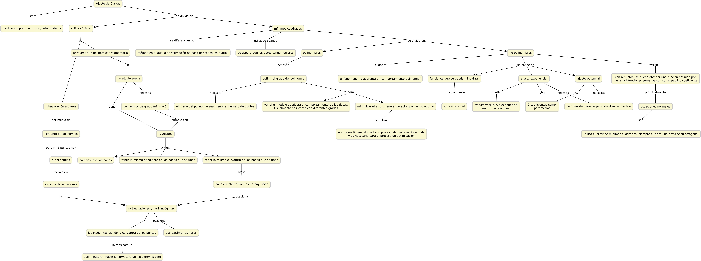

## [Regresar al ínidce](https://github.com/neto-riga/metodos_numericos_2/blob/main/portafolio.md#índice)

# Mapa conceptual. Interpolación Polinomial

En este ejercicio se muestra un mapa conceptual que intenta abarcar todos los temas vistos en la unidad 3. Esto es **Ajuste de Curvas**.

## [Regresar al ínidce](https://github.com/neto-riga/metodos_numericos_2/blob/main/portafolio.md#índice)
